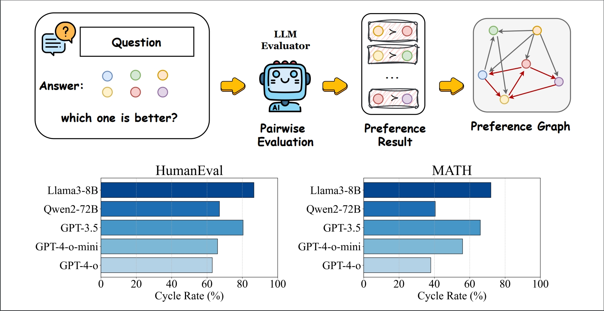

# Language Model Preference Evaluation with Multiple Weak Evaluators
This paper introduces GED (Preference Graph Ensemble and Denoise), a method designed to improve the evaluation of large language models' (LLMs) outputs by ensembling multiple weak evaluators and applying denoising techniques to resolve cyclic inconsistencies in preference graphs, resulting in more reliable, non-contradictory preference evaluations


<h1 style="text-align:left">
    
</h1>


## Setup

Install all required dependencies to ensure all scripts function correctly.

```bash
pip install -r requirements.txt
```

## Rank result generation

```bash
python rank_gen.py \
    --eval_model $eval_model \
    --answer_model $answer_model \
    --task_name $task_name \
    --w_type $w_type \
    --rank_type $rank_type
```


- `--eval_model`: The model used for evaluation.  (Like: 'llama3-8b').
- `--answer_model`: The model generating the answers.  (Like: 'qwen1.5-32b').
- `--task_name`: The task for evaluation. (Like: '10k-ultra').
- `--rank_type`: The ranking method. (Like: 'pairwise_majority').
- `--ensemble_type`: The type of ensemble method used. (Like: 'graph_ensemble').

This script generates updated rankings, denoising conflicting evaluations from the weak evaluators to produce reliable results.